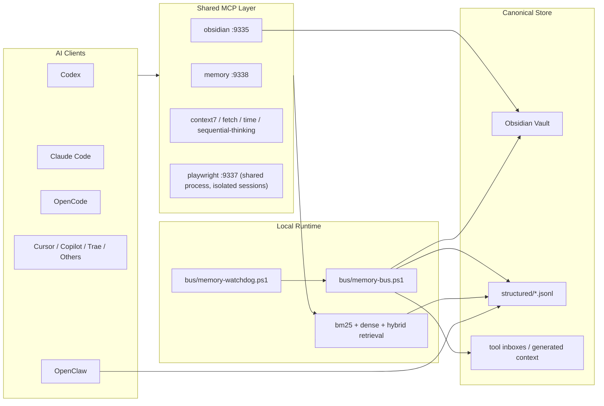

# Obsidian Shared AI Memory Bus

Portable PowerShell-based bundle for building a local-first, Obsidian-backed shared memory layer across multiple AI tools such as Codex, Claude Code, OpenCode, Cursor, Copilot, Trae, and OpenClaw.

This repository packages the architecture, runtime scripts, shared MCP services, onboarding helpers, verification tools, and optional embedding utilities used to run a cross-tool memory bus on one machine. The full control plane is live-validated on Windows, while the portable installer/runtime entrypoints now ship for Windows, macOS, and Linux with source-tree and installed-wrapper smoke coverage.

The source tree is grouped by responsibility (`bus/`, `ops/`, `retrieval/`, `shared-mcp/`), while the installed runtime under `~/.ai-memory` stays intentionally flat for compatibility with existing startup hooks and client configs. That source-to-install contract is defined in `scripts/install-layout.psd1`.

## Project Status
- Ready for real local use on Windows
- Portable install/startup entrypoints now ship for macOS and Linux
- Local-first by default, with optional remote embeddings
- Best suited for one machine hosting many agents and tools
- Public template-quality bundle, but still opinionated and evolving

## What This Is
- A reusable local memory bus template for multi-agent setups
- A process-deduplicated shared MCP stack for safe-to-share services
- A canonical Obsidian-backed memory layer with hybrid retrieval

## What This Is Not
- Not a hosted SaaS
- Not a single merged super-context for every agent
- Not a guarantee that every MCP should or can be shared
- Not a replacement for backup or sync hygiene in your Obsidian vault

## What This Gives You
- One canonical long-term memory store in Obsidian
- Layered memory outputs inspired by Claude-style session memory and OpenClaw-style task blackboards
- One shared `memory` MCP service instead of per-agent local memory processes
- Shared `obsidian` MCP for direct note reads and writes
- One shared `playwright` MCP backend so multi-agent browser tasks stop spawning one local Playwright server per client
- Background watchdog sync from tool-native memory into structured shared memory
- Watchdog heavy refresh gating based on real structured-memory signature changes instead of every observed source change
- Auto-built `MEMORY-LAYERS` and `AUTO-DREAM` summaries for handoff, compaction, and typed durable promotion
- Auto-built `HANDOFF` pack with bounded `goal / done / next / blocked / files / open_threads / tool_invariants`
- Generated artifacts now carry explicit `contractVersion`, `recordSchemaVersion`, and content-hash-based `sourceStructuredSignature` metadata instead of relying only on timestamps
- The governed structured-memory universe now explicitly includes imported `claude-code.jsonl` and `openclaw.jsonl`, not just local session/event/task layers
- Generated onboarding packs that bundle shared HTTP MCP snippets, a portable skill template, and a thin plugin-adapter contract for new agents
- OpenClaw session, job, run, blackboard, and journal sync into shared structured memory
- Hybrid retrieval with `bm25`, offline dense `hashing-v1`, optional remote embeddings, and route-aware layered reranking
- Typed durable promotion metadata (`metadata.promotion`) that classifies durable writeback candidates into `user / feedback / project / reference` and preserves `source_type / source_confidence` for auditable queue generation
- Installer-side Python runtime auto-detection, including uv-managed Python, so shared retrieval does not depend on `python` being on `PATH`
- Installer-side bootstrap of lightweight retrieval dependencies (`rank-bm25`, `jieba`) so BM25 scoring and Chinese tokenization do not silently degrade on fresh machines
- Shared `fetch` / `time` startup now prefers a managed Python 3.10+ runtime through `AI_MEMORY_MCP_PYTHON` instead of cold-starting `uvx` on every launch
- Vault root auto-discovery from environment overrides, the Obsidian app config, or standard Desktop/Documents fallback paths
- No native Node `sqlite3` dependency in the shared `memory` MCP or the OpenClaw blackboard daemon
- A warm shared Python retrieval worker behind the `memory` MCP so BM25 state and model caches can be reused across requests
- Shared retrieval worker cache introspection and cache-reset control through `memory_status` and `clear_shared_memory_search_cache`
- Runtime embedding catalog and selection controls through `list_embedding_runtimes` and `set_embedding_runtime`, with drift detection exposed as `memory_status.embeddingIndexState`
- Query-intent routing controls through `search_shared_memory.route`, with live route metadata surfaced as `queryIntent`, `queryRoute`, `layerCounts`, and per-result `rankMeta`
- Versioned memory-contract validation through `ops/check-memory-integrity.js` and live integrity reporting through `memory_status.memoryIntegrity`
- Pressure-test and verification tooling for multi-agent setups
- An explicit source-to-install contract with stale runtime cleanup plus Windows and portable-core CI validation

## Who This Is For
- People running multiple local AI agents on one machine
- Setups where Obsidian should be the durable source of truth
- Users who want shared retrieval without blindly sharing every tool process

## Who This Is Not For
- Fully managed cloud deployments
- Zero-touch cross-device sync stacks with no local operator
- Setups that need every desktop/UI-bound tool to be globally shared

## System Overview


## High-Level Flow
1. Install the bundle into `~/.ai-memory`
2. Point it at your Obsidian vault
3. Start the shared MCP stack
4. Wire clients to shared HTTP MCP endpoints
5. Let the watchdog keep shared memory fresh
6. Verify with pressure tests before heavy multi-agent use

## Trust Boundaries
- Shared:
  `memory`, `obsidian`, `context7`, `fetch`, `time`, `sequential-thinking`
- Shared process, but session-isolated:
  `playwright`
- Intentionally isolated:
  `pencil` and other UI-bound desktop tools

Shared MCP deduplicates processes. It does not merge all agent state into one conversation. Each client still has its own session lifecycle and tool calls.

## Support Matrix
| Target | Status | Notes |
| --- | --- | --- |
| Codex | First-class | Shared MCP and Obsidian workflow are validated |
| Claude Code | First-class | Shared MCP and claude-mem bridge are validated |
| OpenCode | First-class | Shared MCP and memory recall are validated |
| OpenClaw | Supported | Synced through structured memory and blackboard bridge |
| Cursor | Supported | MCP config wiring supported |
| VS Code / GitHub Copilot | Supported | Config wiring and snapshot import supported |
| Trae | Portable target | Use the new-agent integration guide |
| Other MCP-capable agents | Portable target | Prefer the onboarding flow in `docs/NEW-AGENT-INTEGRATION.md` |
| Portable core on macOS/Linux | Supported | `pwsh` + `.sh` entrypoints ship for install/start/status/stop flows; Windows still has the deepest live acceptance coverage |

## Included
- Core bus runtime (`bus/`):
  - `bus/memory-bus.ps1`
  - `bus/memory-watchdog.ps1`
  - `bus/register-agent.ps1`
  - `bus/generate-embeddings.js`
- Operations (`ops/`):
  - `ops/build-handoff-pack.js`
  - `ops/build-memory-layers.js`
  - `ops/run-memory-dream.ps1`
  - `ops/run-obsidian-mcp.ps1`
  - `ops/run-minimax-mcp.ps1`
  - `ops/verify-integrations.ps1`
  - `ops/verify-client-integrations.ps1`
  - `ops/sync-shared-skills.ps1`
  - `ops/run-pressure-test.ps1`
  - `ops/cleanup-inbox.ps1`
  - `ops/repair-codex-runtime.ps1`
  - `ops/sync-claudemem-to-obsidian.ps1`
  - `ops/sync-openclaw-to-obsidian.js`
  - `ops/obsidian-blackboard-daemon.js`
- Retrieval and embeddings (`retrieval/`):
  - `retrieval/benchmark-architecture.py`
  - `retrieval/semantic-search.py`
  - `retrieval/semantic-search.js`
  - `retrieval/probe-models.py`
  - `retrieval/benchmark-backends.py`
- Runtime portability helpers:
  - `bus/runtime-platform.ps1`
  - `bus/python-runtime.js`
  - `shared-mcp/python-runtime.cjs`
- Shared MCP runtime under `shared-mcp/`:
  - `omni-memory-server.js`
  - `manifest.json`
  - `start-shared-mcp.ps1`
  - `start-shared-mcp.sh`
  - `start-default-shared-mcp.ps1`
  - `start-default-shared-mcp.sh`
  - `stop-shared-mcp.ps1`
  - `stop-shared-mcp.sh`
  - `status-shared-mcp.ps1`
  - `status-shared-mcp.sh`
  - `write-config-snippets.ps1`
  - `singleton-stdio-mcp-proxy.mjs`
  - `playwright-stdio-proxy.js`
  - `package.json`

## Shared MCP Defaults
Started by `shared-mcp/start-default-shared-mcp.ps1` or `shared-mcp/start-default-shared-mcp.sh`:
- `context7`
- `fetch`
- `time`
- `sequential-thinking`
- `obsidian`
- `memory`
- `playwright`
- `MiniMax` only when `MINIMAX_API_HOST` and `MINIMAX_API_KEY` are present

Still isolated:
- `pencil`

The manifest keeps `playwright` marked as an optional server so advanced users can opt out or manage it separately, but the default starter opts into it because duplicated local Playwright MCP launches are usually the biggest process multiplier in multi-agent workflows.

## Recommended Integration Bundle
For most agents, the best packaged setup is:

1. shared HTTP MCP for transport and process deduplication
2. a portable skill or rule file for read order, writeback policy, and task decomposition
3. a thin plugin adapter only if the host app needs native lifecycle hooks, UI, or settings surfaces

The generated onboarding packs under `generated/onboarding/<agent>/` are designed around that split. They now include:
- shared HTTP MCP snippets for Codex, Cursor, and Copilot-style hosts
- a stdio fallback snippet for hosts that still need a local launcher
- a portable skill template
- a thin plugin-adapter guide
- platform guidance for Windows, macOS, and Linux

## Verification Story
- Shared MCP services for `context7`, `fetch`, `time`, `sequential-thinking`, `obsidian`, `MiniMax`, and `memory` were validated on `9331-9336` and `9338`
- The shared Playwright backend was validated on `9337` with real MCP `initialize`, `tools/list`, `browser_navigate`, and `browser_snapshot` calls
- Multi-wave pressure tests passed with stable shared listener PIDs
- Client integration checks were validated for Codex, Claude Code, OpenCode, Cursor, and VS Code/Copilot paths
- The POSIX wrapper layer was smoke-checked through Git Bash using `scripts/validate-layout.sh` and `shared-mcp/status-shared-mcp.sh`
- The shared `memory` MCP now keeps a persistent Python retrieval worker and only falls back to one-shot search if the worker is unavailable

See `docs/VALIDATION.md` for the current test story and reproduction flow.

## Portable Overlay Placeholders
Tracked onboarding and overlay files in this repo intentionally use portable placeholders instead of workstation-specific absolute paths.

- `<obsidian-vault>` means the root of the Obsidian vault that hosts `00-System/ai-memory/` and `02-KB/`
- `<repo-root>` means the checked-out repository root for this bundle or for the agent-specific project overlay
- `~/.trae/user_rules.md` is shown as a user-home-relative example, not a hardcoded machine path

At runtime, the bundle resolves the vault from:

1. `AI_MEMORY_OBSIDIAN_VAULT`
2. `OBSIDIAN_VAULT_ROOT`
3. the active or most recent vault in Obsidian's app config on Windows, macOS, or Linux
4. standard fallback locations such as `~/Obsidian Vault`, Desktop, or Documents when needed

Public docs and tracked overlay files should never be committed with private paths such as `C:\Users\name\...`, `/Users/name/...`, `/home/name/...`, or `E:\...`.

## Install
Windows:
```powershell
powershell.exe -NoProfile -ExecutionPolicy Bypass -File .\scripts\install.ps1
```

macOS/Linux (`pwsh` required):
```bash
./scripts/install.sh
```

On Windows, the installer writes `AI_MEMORY_ROOT` into your user environment and registers per-user startup hooks through the Startup folder.
On macOS, startup registration is emitted as LaunchAgents. On Linux, it prefers `systemd --user` units and falls back to XDG autostart when `systemctl --user` is unavailable.
On macOS/Linux, the installer generates `~/.ai-memory/activate-ai-memory.sh` and `~/.ai-memory/activate-ai-memory.ps1` instead of mutating shell startup files automatically.
It also generates root-level `.sh` wrappers for installed runtime commands, so macOS/Linux users can call `~/.ai-memory/run-pressure-test.sh`, `~/.ai-memory/verify-client-integrations.sh`, `~/.ai-memory/memory-bus.sh`, and similar entrypoints directly. Those wrappers are POSIX `sh`, not Bash-only scripts.
Before install, source-tree direct runs can fall back to `templates/config/runtime.json`; the installed runtime should use `~/.ai-memory/config/runtime.json`.

## Maintainer Guardrails
Before changing runtime file names, paths, or startup entrypoints, validate the source-to-install contract:

```powershell
powershell.exe -NoProfile -ExecutionPolicy Bypass -File .\scripts\validate-layout.ps1
node .\ops\check-memory-integrity.js --strict
```

```bash
./scripts/validate-layout.sh
node ./ops/check-memory-integrity.js --strict
```

The installer also writes `~/.ai-memory/install-manifest.json` so upgrades can prune stale managed runtime files left behind by older layouts or renamed entrypoints.

When rebuilding generated memory artifacts manually, keep the build order serial:

```powershell
node .\ops\build-memory-layers.js
node .\ops\build-handoff-pack.js
powershell.exe -NoProfile -ExecutionPolicy Bypass -File .\ops\run-memory-dream.ps1 -Force
```

`HANDOFF` and `AUTO-DREAM` depend on the current structured-layer snapshot, so parallel rebuilds can produce intentionally detectable signature drift.

CI guardrails for that contract live in `.github/workflows/portable-core.yml` and `.github/workflows/windows-validate.yml`.

## Minimal Quick Start

> **What is `<your-project-root>`?** It is the directory where your AI agent's config files live. For Claude Code, this is your `.claude/` directory. For Codex, it is your `.codex/` directory. For other agents, point it at the directory where that agent stores its settings. The scripts will write per-agent MCP config snippets into a `mcp configs/` subdirectory there; they will not modify your existing settings directly.

> **Prerequisites**: An Obsidian vault already exists with at least the `00-System/ai-memory/` directory structure. If your vault is empty or on a different drive, set `AI_MEMORY_OBSIDIAN_VAULT` to its root path before running.

```powershell
powershell.exe -NoProfile -ExecutionPolicy Bypass -File .\scripts\install.ps1
powershell.exe -NoProfile -ExecutionPolicy Bypass -File $env:AI_MEMORY_ROOT\shared-mcp\start-default-shared-mcp.ps1
powershell.exe -NoProfile -ExecutionPolicy Bypass -File $env:AI_MEMORY_ROOT\verify-integrations.ps1 -WorkspaceRoot <your-project-root>
powershell.exe -NoProfile -ExecutionPolicy Bypass -File $env:AI_MEMORY_ROOT\verify-client-integrations.ps1 -WorkspaceRoot <your-project-root> -RunCliChecks
powershell.exe -NoProfile -ExecutionPolicy Bypass -File $env:AI_MEMORY_ROOT\run-pressure-test.ps1 -WorkspaceRoot <your-project-root> -Waves 5 -RunCliChecks
```

```bash
./scripts/install.sh
~/.ai-memory/shared-mcp/start-default-shared-mcp.sh
~/.ai-memory/verify-integrations.sh -WorkspaceRoot <your-project-root>
~/.ai-memory/verify-client-integrations.sh -WorkspaceRoot <your-project-root> -RunCliChecks
~/.ai-memory/run-pressure-test.sh -WorkspaceRoot <your-project-root> -Waves 5 -RunCliChecks
```

**What to expect**: The pressure test runs 5 waves of concurrent MCP health checks against all shared endpoints (9331-9338). "passed" means every wave returned the expected responses with no crashes or duplicate PIDs. If you see failures, see [`docs/TROUBLESHOOTING.md`](docs/TROUBLESHOOTING.md) or the operational FAQ in [`docs/FAQ.md`](docs/FAQ.md).

## Optional Remote Embeddings
The default dense retrieval backend is offline `hashing-v1`.

The runtime now resolves embeddings through a decoupled registry:
- `embeddings.defaults`
- `embeddings.providers.<name>`
- `embeddings.profiles.<name>.provider`

That lets you keep provider transport details separate from task-oriented profiles. A provider defines the adapter and transport. A profile chooses a provider and can override model, delay, or batching behavior without copying the full provider block.

You can switch selection at runtime with:
- `AI_MEMORY_EMBED_PROFILE`
- `AI_MEMORY_EMBED_PROVIDER`
- `AI_MEMORY_EMBED_ADAPTER`

Legacy `AI_MEMORY_EMBED_BACKEND` still works as a compatibility alias for `AI_MEMORY_EMBED_ADAPTER`.

In the long-running shared `memory` MCP, persisted `runtime.json` is now treated as the canonical selector by default. Selection/tuning environment overrides for profile/provider/adapter/model/base-url are ignored unless you explicitly opt in with:

```powershell
$env:AI_MEMORY_ALLOW_EMBED_RUNTIME_ENV_OVERRIDES = "1"
```

Use that only when you intentionally want one process to ignore the saved runtime selection.

This is a real config/plugin boundary, but it is still not a true dense hot-swap boundary: after changing adapter, model, or base URL, rebuild the stored embeddings index so query-time vectors and stored vectors stay aligned.

The shared `memory` MCP now exposes a small control plane for this:
- `list_embedding_runtimes`
- `set_embedding_runtime`
- `memory_status.embeddingIndexState`
- `memory_status.memoryIntegrity`

That means agents can discover the configured providers/profiles, switch the persisted selection, and immediately see whether the current dense index is aligned or whether a rebuild is still required. They can also inspect whether the structured memory files, generated summaries, and duplicate/invalid records are still in a healthy state instead of assuming the shared memory stack is fine just because the process is alive.

`list_embedding_runtimes` now also annotates each provider/profile with:
- `configHash`
- `indexedCount`
- `indexCompatible`
- `rebuildRequired`

If you want to test an OpenAI-compatible embedding API, set:
```powershell
$env:AI_MEMORY_EMBED_PROVIDER = "openai-compatible-remote"
$env:AI_MEMORY_EMBED_ADAPTER = "openai-compatible"
$env:AI_MEMORY_EMBED_BASE_URL = "https://your-openai-compatible-endpoint/v1"
$env:AI_MEMORY_EMBED_API_KEY = "<your-key>"
$env:AI_MEMORY_EMBED_MODEL = "<your-model-id>"
$env:AI_MEMORY_EMBED_PROFILE = "openai-compatible"
```

Then rebuild the shared embeddings index so the stored vectors match the active provider:

```powershell
node $env:AI_MEMORY_ROOT\generate-embeddings.js
```

```bash
export AI_MEMORY_EMBED_PROVIDER="openai-compatible-remote"
export AI_MEMORY_EMBED_ADAPTER="openai-compatible"
export AI_MEMORY_EMBED_BASE_URL="https://your-openai-compatible-endpoint/v1"
export AI_MEMORY_EMBED_API_KEY="<your-key>"
export AI_MEMORY_EMBED_MODEL="<your-model-id>"
export AI_MEMORY_EMBED_PROFILE="openai-compatible"
node ~/.ai-memory/generate-embeddings.js
```

The index records a provider fingerprint (`adapter + model + base URL`) so switching remote embedding endpoints will not silently reuse stale vectors. If you change provider settings and keep seeing BM25-only fallbacks, rebuild the index again and inspect `memory_status.embeddingRuntime` plus `memory_status.embeddings.backends`, `memory_status.embeddings.models`, `memory_status.embeddings.dimensions`, and `memory_status.embeddings.providerHosts`.

For consistency, remote rebuilds now fail the run instead of silently mixing `openai` and `hashing-v1` vectors in the same index. Only set `AI_MEMORY_EMBED_ALLOW_BATCH_FALLBACK=1` if you explicitly want per-batch fallback behavior.

Use the included probe and benchmark scripts before doing any full reindex.

## Security
- No tokens or API keys are intentionally stored in this repository
- Secrets must be supplied through user or machine environment variables
- Machine-specific absolute paths are resolved dynamically at install or runtime
- Before publishing a fork, rescan for accidental credentials in configs or reports

## Docs
- [`docs/INSTALL.md`](docs/INSTALL.md)
- [`docs/ARCHITECTURE.md`](docs/ARCHITECTURE.md)
- [`docs/MEMORY-ARCHITECTURE-CRITIQUE.md`](docs/MEMORY-ARCHITECTURE-CRITIQUE.md)
- [`docs/DEPLOYMENT-MATRIX.md`](docs/DEPLOYMENT-MATRIX.md)
- [`docs/FILES.md`](docs/FILES.md)
- [`docs/FAQ.md`](docs/FAQ.md)
- [`docs/NEW-AGENT-INTEGRATION.md`](docs/NEW-AGENT-INTEGRATION.md)
- [`docs/INTEGRATION-MODES.md`](docs/INTEGRATION-MODES.md)
- [`docs/OPERATIONS.md`](docs/OPERATIONS.md)
- [`docs/RELEASING.md`](docs/RELEASING.md)
- [`docs/ROADMAP.md`](docs/ROADMAP.md)
- [`docs/TROUBLESHOOTING.md`](docs/TROUBLESHOOTING.md)
- [`docs/SECURITY.md`](docs/SECURITY.md)
- [`docs/VALIDATION.md`](docs/VALIDATION.md)

## Community
- [`CONTRIBUTING.md`](CONTRIBUTING.md)
- [`CODE_OF_CONDUCT.md`](CODE_OF_CONDUCT.md)
- [`docs/SECURITY.md`](docs/SECURITY.md)
- [`SUPPORT.md`](SUPPORT.md)
- [`LICENSE`](LICENSE)
