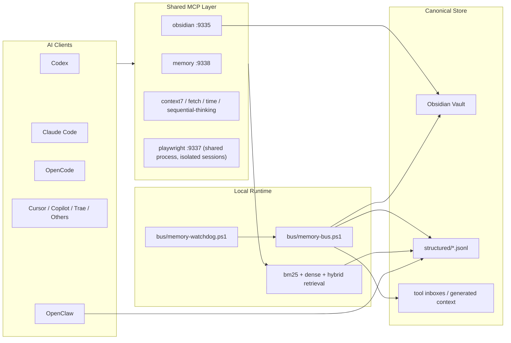

# Obsidian Shared AI Memory Bus

Portable Windows-first bundle for building a local-first, Obsidian-backed shared memory layer across multiple AI tools such as Codex, Claude Code, OpenCode, Cursor, Copilot, Trae, and OpenClaw.

This repository packages the architecture, runtime scripts, shared MCP services, onboarding helpers, verification tools, and optional embedding utilities used to run a cross-tool memory bus on one machine. The full control plane is validated on Windows, while the core memory pipeline is now smoke-validated in CI on Windows, macOS, and Linux.

The source tree is grouped by responsibility (`bus/`, `ops/`, `retrieval/`, `shared-mcp/`), while the installed runtime under `%USERPROFILE%\.ai-memory` stays intentionally flat for compatibility with existing startup hooks and client configs. That source-to-install contract is defined in `scripts/install-layout.psd1`.

## Project Status
- Ready for real local use on Windows
- Local-first by default, with optional remote embeddings
- Best suited for one machine hosting many agents and tools
- Public template-quality bundle, but still opinionated and evolving

## What This Is
- A reusable local memory bus template for multi-agent setups
- A process-deduplicated shared MCP stack for safe-to-share services
- A canonical Obsidian-backed memory layer with hybrid retrieval

## What This Is Not
- Not a hosted SaaS
- Not a single merged super-context for every agent
- Not a guarantee that every MCP should or can be shared
- Not a replacement for backup or sync hygiene in your Obsidian vault

## What This Gives You
- One canonical long-term memory store in Obsidian
- Layered memory outputs inspired by Claude-style session memory and OpenClaw-style task blackboards
- One shared `memory` MCP service instead of per-agent local memory processes
- Shared `obsidian` MCP for direct note reads and writes
- One shared `playwright` MCP backend so multi-agent browser tasks stop spawning one local Playwright server per client
- Background watchdog sync from tool-native memory into structured shared memory
- Auto-built `MEMORY-LAYERS` and `AUTO-DREAM` summaries for handoff, compaction, and durable promotion
- Auto-built `HANDOFF` pack with bounded `goal / done / next / blocked / files / open_threads / tool_invariants`
- Generated onboarding packs that bundle shared HTTP MCP snippets, a portable skill template, and a thin plugin-adapter contract for new agents
- OpenClaw session, job, run, blackboard, and journal sync into shared structured memory
- Hybrid retrieval with `bm25`, offline dense `hashing-v1`, and optional remote embeddings
- Installer-side Python runtime auto-detection, including uv-managed Python, so shared retrieval does not depend on `python` being on `PATH`
- Vault root auto-discovery from environment overrides, the Obsidian app config, or standard Desktop/Documents fallback paths
- No native Node `sqlite3` dependency in the shared `memory` MCP or the OpenClaw blackboard daemon
- Pressure-test and verification tooling for multi-agent setups
- An explicit source-to-install contract with stale runtime cleanup and Windows CI validation

## Who This Is For
- People running multiple local AI agents on one Windows machine
- Setups where Obsidian should be the durable source of truth
- Users who want shared retrieval without blindly sharing every tool process

## Who This Is Not For
- Fully managed cloud deployments
- Zero-touch cross-device sync stacks with no local operator
- Setups that need every desktop/UI-bound tool to be globally shared

## System Overview


## High-Level Flow
1. Install the bundle into `%USERPROFILE%\.ai-memory`
2. Point it at your Obsidian vault
3. Start the shared MCP stack
4. Wire clients to shared HTTP MCP endpoints
5. Let the watchdog keep shared memory fresh
6. Verify with pressure tests before heavy multi-agent use

## Trust Boundaries
- Shared:
  `memory`, `obsidian`, `context7`, `fetch`, `time`, `sequential-thinking`
- Shared process, but session-isolated:
  `playwright`
- Intentionally isolated:
  `pencil` and other UI-bound desktop tools

Shared MCP deduplicates processes. It does not merge all agent state into one conversation. Each client still has its own session lifecycle and tool calls.

## Support Matrix
| Target | Status | Notes |
| --- | --- | --- |
| Codex | First-class | Shared MCP and Obsidian workflow are validated |
| Claude Code | First-class | Shared MCP and claude-mem bridge are validated |
| OpenCode | First-class | Shared MCP and memory recall are validated |
| OpenClaw | Supported | Synced through structured memory and blackboard bridge |
| Cursor | Supported | MCP config wiring supported |
| VS Code / GitHub Copilot | Supported | Config wiring and snapshot import supported |
| Trae | Portable target | Use the new-agent integration guide |
| Other MCP-capable agents | Portable target | Prefer the onboarding flow in `docs/NEW-AGENT-INTEGRATION.md` |
| Portable core on macOS/Linux | Supported | Core memory generation, dream consolidation, and retrieval smoke-tested in CI; full installer/startup remains Windows-first |

## Included
- Core bus runtime (`bus/`):
  - `bus/memory-bus.ps1`
  - `bus/memory-watchdog.ps1`
  - `bus/register-agent.ps1`
  - `bus/generate-embeddings.js`
- Operations (`ops/`):
  - `ops/build-handoff-pack.js`
  - `ops/build-memory-layers.js`
  - `ops/run-memory-dream.ps1`
  - `ops/run-obsidian-mcp.ps1`
  - `ops/run-minimax-mcp.ps1`
  - `ops/verify-integrations.ps1`
  - `ops/verify-client-integrations.ps1`
  - `ops/sync-shared-skills.ps1`
  - `ops/run-pressure-test.ps1`
  - `ops/cleanup-inbox.ps1`
  - `ops/repair-codex-runtime.ps1`
  - `ops/sync-claudemem-to-obsidian.ps1`
  - `ops/sync-openclaw-to-obsidian.js`
  - `ops/obsidian-blackboard-daemon.js`
- Retrieval and embeddings (`retrieval/`):
  - `retrieval/benchmark-architecture.py`
  - `retrieval/semantic-search.py`
  - `retrieval/semantic-search.js`
  - `retrieval/probe-models.py`
  - `retrieval/benchmark-backends.py`
- Runtime portability helpers:
  - `bus/python-runtime.js`
  - `shared-mcp/python-runtime.cjs`
- Shared MCP runtime under `shared-mcp/`:
  - `omni-memory-server.js`
  - `manifest.json`
  - `start-shared-mcp.ps1`
  - `start-default-shared-mcp.ps1`
  - `stop-shared-mcp.ps1`
  - `status-shared-mcp.ps1`
  - `write-config-snippets.ps1`
  - `singleton-stdio-mcp-proxy.mjs`
  - `playwright-stdio-proxy.js`
  - `package.json`

## Shared MCP Defaults
Started by `shared-mcp/start-default-shared-mcp.ps1`:
- `context7`
- `fetch`
- `time`
- `sequential-thinking`
- `obsidian`
- `memory`
- `playwright`
- `MiniMax` only when `MINIMAX_API_HOST` and `MINIMAX_API_KEY` are present

Still isolated:
- `pencil`

The manifest keeps `playwright` marked as an optional server so advanced users can opt out or manage it separately, but the default starter opts into it because duplicated local Playwright MCP launches are usually the biggest process multiplier in multi-agent workflows.

## Recommended Integration Bundle
For most agents, the best packaged setup is:

1. shared HTTP MCP for transport and process deduplication
2. a portable skill or rule file for read order, writeback policy, and task decomposition
3. a thin plugin adapter only if the host app needs native lifecycle hooks, UI, or settings surfaces

The generated onboarding packs under `generated/onboarding/<agent>/` are designed around that split. They now include:
- shared HTTP MCP snippets for Codex, Cursor, and Copilot-style hosts
- a stdio fallback snippet for hosts that still need a local launcher
- a portable skill template
- a thin plugin-adapter guide
- platform guidance for Windows, macOS, and Linux

## Verification Story
- Shared MCP services for `context7`, `fetch`, `time`, `sequential-thinking`, `obsidian`, `MiniMax`, and `memory` were validated on `9331-9336` and `9338`
- The shared Playwright backend was validated on `9337` with real MCP `initialize`, `tools/list`, `browser_navigate`, and `browser_snapshot` calls
- Multi-wave pressure tests passed with stable shared listener PIDs
- Client integration checks were validated for Codex, Claude Code, OpenCode, Cursor, and VS Code/Copilot paths

See `docs/VALIDATION.md` for the current test story and reproduction flow.

## Portable Overlay Placeholders
Tracked onboarding and overlay files in this repo intentionally use portable placeholders instead of workstation-specific absolute paths.

- `<obsidian-vault>` means the root of the Obsidian vault that hosts `00-System/ai-memory/` and `02-KB/`
- `<repo-root>` means the checked-out repository root for this bundle or for the agent-specific project overlay
- `~/.trae/user_rules.md` is shown as a user-home-relative example, not a hardcoded machine path

At runtime, the Windows control plane resolves the vault from:

1. `AI_MEMORY_OBSIDIAN_VAULT`
2. `OBSIDIAN_VAULT_ROOT`
3. the active or most recent vault in Obsidian's app config
4. standard fallback locations such as Desktop or Documents when needed

Public docs and tracked overlay files should never be committed with private paths such as `C:\Users\name\...` or `E:\...`.

## Install
```powershell
powershell.exe -NoProfile -ExecutionPolicy Bypass -File .\scripts\install.ps1
```

The installer writes `AI_MEMORY_ROOT` into your user environment so shared MCP commands can locate the installed runtime without hardcoded machine-specific paths.

## Maintainer Guardrails
Before changing runtime file names, paths, or startup entrypoints, validate the source-to-install contract:

```powershell
powershell.exe -NoProfile -ExecutionPolicy Bypass -File .\scripts\validate-layout.ps1
```

The installer also writes `%USERPROFILE%\.ai-memory\install-manifest.json` so upgrades can prune stale managed runtime files left behind by older layouts or renamed entrypoints.

## Minimal Quick Start

> **What is `<your-project-root>`?** It is the directory where your AI agent's config files live. For Claude Code, this is your `.claude/` directory. For Codex, it is your `.codex/` directory. For other agents, point it at the directory where that agent stores its settings. The scripts will write per-agent MCP config snippets into a `mcp configs/` subdirectory there; they will not modify your existing settings directly.

> **Prerequisites**: An Obsidian vault already exists with at least the `00-System/ai-memory/` directory structure. If your vault is empty or on a different drive, set `AI_MEMORY_OBSIDIAN_VAULT` to its root path before running.

```powershell
powershell.exe -NoProfile -ExecutionPolicy Bypass -File .\scripts\install.ps1
powershell.exe -NoProfile -ExecutionPolicy Bypass -File $env:USERPROFILE\.ai-memory\shared-mcp\start-default-shared-mcp.ps1
powershell.exe -NoProfile -ExecutionPolicy Bypass -File $env:USERPROFILE\.ai-memory\verify-integrations.ps1 -WorkspaceRoot <your-project-root>
powershell.exe -NoProfile -ExecutionPolicy Bypass -File $env:USERPROFILE\.ai-memory\verify-client-integrations.ps1 -WorkspaceRoot <your-project-root> -RunCliChecks
powershell.exe -NoProfile -ExecutionPolicy Bypass -File $env:USERPROFILE\.ai-memory\run-pressure-test.ps1 -WorkspaceRoot <your-project-root> -Waves 5 -RunCliChecks
```

**What to expect**: The pressure test runs 5 waves of concurrent MCP health checks against all shared endpoints (9331-9338). "passed" means every wave returned the expected responses with no crashes or duplicate PIDs. If you see failures, see [`docs/TROUBLESHOOTING.md`](docs/TROUBLESHOOTING.md) or the operational FAQ in [`docs/FAQ.md`](docs/FAQ.md).

## Optional Remote Embeddings
The default dense retrieval backend is offline `hashing-v1`.

If you want to test an OpenAI-compatible embedding API, set:
```powershell
$env:AI_MEMORY_EMBED_BACKEND = "openai"
$env:AI_MEMORY_EMBED_BASE_URL = "https://your-openai-compatible-endpoint/v1"
$env:AI_MEMORY_EMBED_API_KEY = "<your-key>"
$env:AI_MEMORY_EMBED_MODEL = "<your-model-id>"
```

Then rebuild the shared embeddings index so the stored vectors match the active provider:

```powershell
node $env:USERPROFILE\.ai-memory\generate-embeddings.js
```

The index now records a provider fingerprint (`backend + model + base URL`) so switching remote embedding endpoints will not silently reuse stale vectors. If you change provider settings and keep seeing BM25-only fallbacks, rebuild the index again and inspect `memory_status` for `embeddings.backends`, `embeddings.models`, `embeddings.dimensions`, and `embeddings.providerHosts`.

For consistency, remote rebuilds now fail the run instead of silently mixing `openai` and `hashing-v1` vectors in the same index. Only set `AI_MEMORY_EMBED_ALLOW_BATCH_FALLBACK=1` if you explicitly want per-batch fallback behavior.

Use the included probe and benchmark scripts before doing any full reindex.

## Security
- No tokens or API keys are intentionally stored in this repository
- Secrets must be supplied through user or machine environment variables
- Machine-specific absolute paths are resolved dynamically at install or runtime
- Before publishing a fork, rescan for accidental credentials in configs or reports

## Docs
- [`docs/INSTALL.md`](docs/INSTALL.md)
- [`docs/ARCHITECTURE.md`](docs/ARCHITECTURE.md)
- [`docs/DEPLOYMENT-MATRIX.md`](docs/DEPLOYMENT-MATRIX.md)
- [`docs/FILES.md`](docs/FILES.md)
- [`docs/FAQ.md`](docs/FAQ.md)
- [`docs/NEW-AGENT-INTEGRATION.md`](docs/NEW-AGENT-INTEGRATION.md)
- [`docs/INTEGRATION-MODES.md`](docs/INTEGRATION-MODES.md)
- [`docs/OPERATIONS.md`](docs/OPERATIONS.md)
- [`docs/RELEASING.md`](docs/RELEASING.md)
- [`docs/ROADMAP.md`](docs/ROADMAP.md)
- [`docs/TROUBLESHOOTING.md`](docs/TROUBLESHOOTING.md)
- [`docs/SECURITY.md`](docs/SECURITY.md)
- [`docs/VALIDATION.md`](docs/VALIDATION.md)

## Community
- [`CONTRIBUTING.md`](CONTRIBUTING.md)
- [`CODE_OF_CONDUCT.md`](CODE_OF_CONDUCT.md)
- [`docs/SECURITY.md`](docs/SECURITY.md)
- [`SUPPORT.md`](SUPPORT.md)
- [`LICENSE`](LICENSE)
